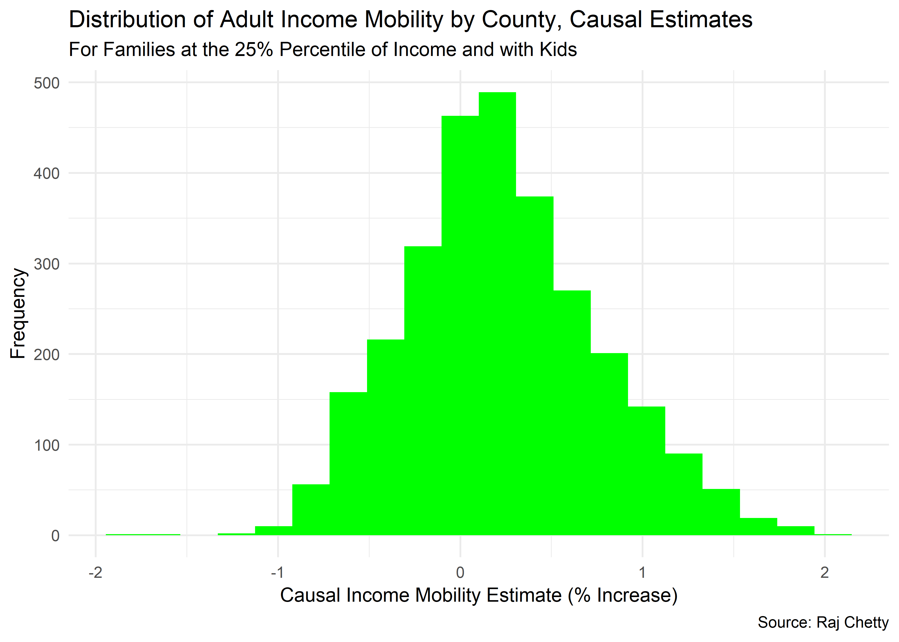
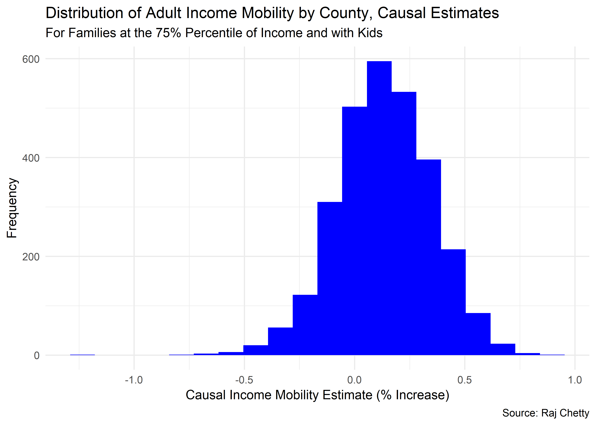
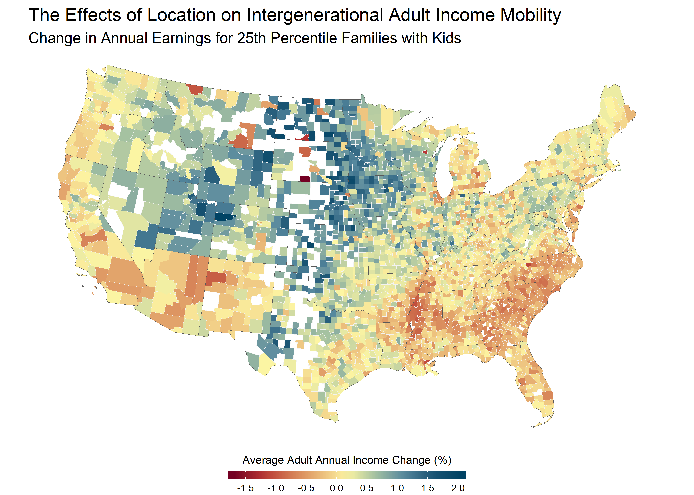
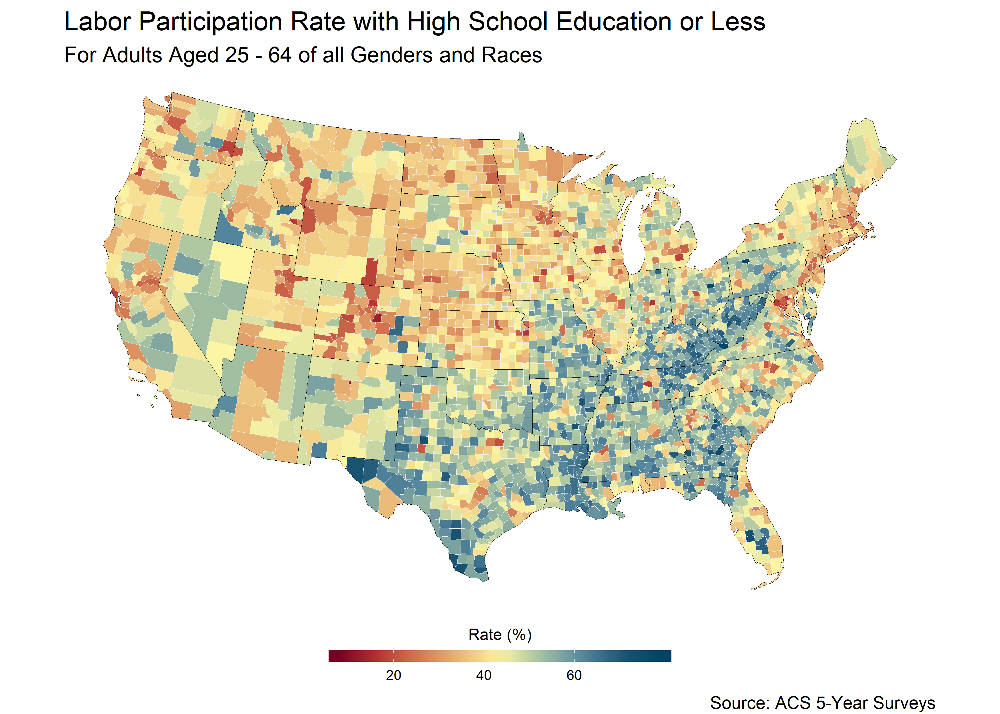
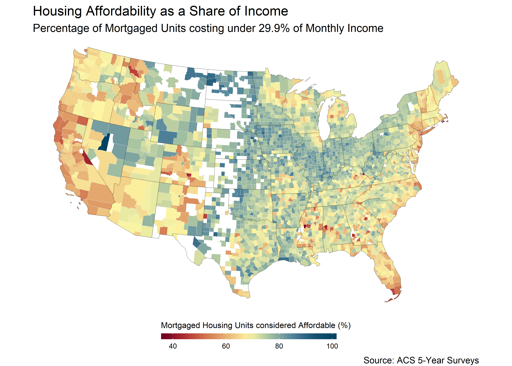
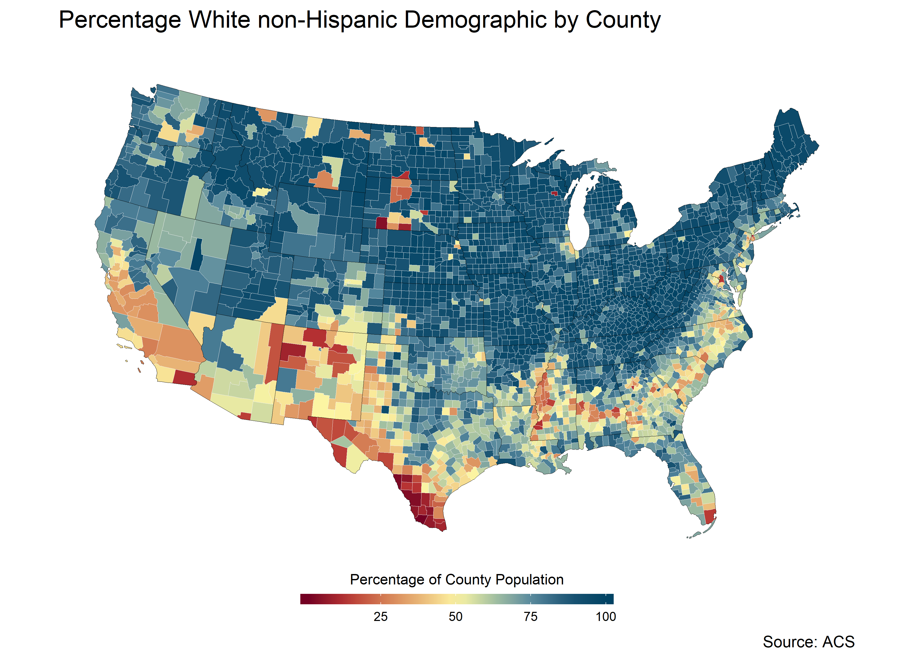
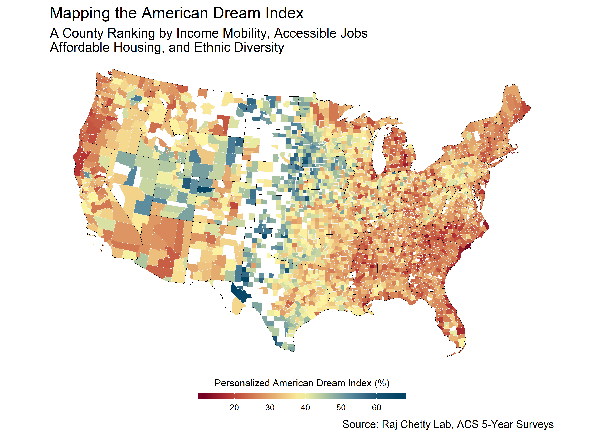

Mapping the American Dream
================
Guillermo Gomez
2018-05-19

-   [Mapping the American Dream](#mapping-the-american-dream)
    -   [A Data Visualization of Opportunity in America](#a-data-visualization-of-opportunity-in-america)
    -   [Effects of Neighborhoods on Intergenerational Mobility, County-Level Estimates](#effects-of-neighborhoods-on-intergenerational-mobility-county-level-estimates)
-   [Read mobility data set, examine the data](#read-mobility-data-set-examine-the-data)
-   [Visualize causal estimates](#visualize-causal-estimates)
    -   [Housing Costs](#housing-costs)
    -   [Ethnic diversity](#ethnic-diversity)
    -   [American Dream Index](#american-dream-index)
    -   [Mapping the American Dream Index](#mapping-the-american-dream-index)

Mapping the American Dream
==========================

#### A Data Visualization of Opportunity in America

In 1931, the writer James Truslow Adams first proposed the term "the American Dream" in his book, , to refer to the ideal

Since then, others have attempted to define what the American Dream means and come up with different interpretations. One famous and yet tragic version of this comes from protagonist Willy Loman in Arthur Miller's . His view that charisma and charm alone can open up opportunity and lead to prosperity both captures the imagination of the everyman reader and leads to self-desctruction, as this American Dream does not hold up. I attempt to come up with a more robust interpretation, one that we can all live by.

This project aims to map US counties which today best represent this definition of the American Dream and would be of interest to a low-income or middle-class family with children. I interpret Adams' statement to refer to four key metrics.

-   Intergenerational income mobility: Adams claims "life should be better and richer and fuller"; fuller than what, we must ask? Fuller than the past, of course.

-   "life should be better and richer ... for everyone." This implies broad accesibility beyond cultural and economic barriers. I do this analysis for the 25th percentile of income, the family solidly below middle class. I also incorporate a measure of ethnic diversity, as moving to a community where one is welcome and not culturally or linguistically isolated leads to a richer, more fulfilling community life.

-   " with opportunity for each according to ability " I define the American dream as the ability to access and live out opportunities for intra- and intergenerational advancement through hard work even given a starting position on a lower socioeconomic "rung" and only high school education. I also define the American dream as the ability to live in a community where one is welcome and not culturally or linguistically isolated. You may find that this definition is incomplete, or you may find that you value certain aspects of this definition of the American dream above others. This project leaves some flexibility for more personalized definitions of the American dream, though these use the same data I do.

-   " with opportunity for each according to ability "

. so as to guide a low-income looking to move soon toward the place where their kids' future will be brightest.

I expand work from the Equality of Opportunity Project, which looks at how location and the environment in which children grow up affects intergenerational income mobility. Kids who move to better counties see a causal rise in their annual adult incomes; the effect outlasts the location, such that even after children leave the better county they'd moved to, their adult incomes are still likely to be higher. I combine this data with various key metrics on employment and jobs, affordability, and ethnic diversity, using the American Community Survey. Raj Chetty's work on intergerational income mobility is visualized in the NY Times article below, and published in the following paper. (<https://www.nytimes.com/interactive/2015/05/03/upshot/the-best-and-worst-places-to-grow-up-how-your-area-compares.html>) (<http://www.rajchetty.com/chettyfiles/movers_paper1.pdf>).

My primary motivation in undertaking this data challenge is to provide a (hypothetical) compelling and practical guide to low-income families thinking of leaving their current county for a place with greater long-term opportunity and advancement for themselves and their children. My analysis simplifies the many complex factors affecting a move and thus is a hypothetical guide more than one which can be made actionable directly.

Effects of Neighborhoods on Intergenerational Mobility, County-Level Estimates
------------------------------------------------------------------------------

The effects of moving to a better county accumulate during childhood but persist into adulthood, RAj Chetty's findings show. Thus, moving to a county with a higher score positively impacts children's adult income earning mobility well into adulthood. This effect is bigger for low-income children (those in the 25th percentile of family inccome) than for richer children (75th percentile), but both benefit from moving to a better county. The negative tail end of the adult income increase estimates for the 75th percentile kids is longer than the positive tail end, implying that there is a possibility for some higher-income kids that moving will be worse than staying.

Read mobility data set, examine the data
========================================

    ## Warning: Column `county` has different attributes on LHS and RHS of join

I want to visualize the income mobility data for the 25th-percentile family in particular, and I focus on this in all subsequent analyses.

Visualize causal estimates
==========================

    ## Warning: Removed 3 rows containing non-finite values (stat_sf).

Here are a few observations on the data displayed in this map. Native reservations show the most negative income mobility. Mobility seems greatest in the upper midwest. The border regions of the Southeast are neutral, the deep south is highy negative. Silicon Valley is not that positive, rather a bit below the median. The Dakotas are highly mobile in some parts but overall very empty. There may be an influence from the oil and gas industry in making some of these counties appear as if they have highly-mobile incomes. Wyoming and Utah are lit up blue, which is surprising. Nevada also fares pretty well. The Northeast is above average but not in the metropolitan areas. Pennsylvania seems to do better than urban zones. Iowa and Minnesota do well throughout. The Central Valley does poorly, below avergae for the country. There is lots of missing data down the middle of the country, visualized by the blank counties.

Looking at the top ten best and worst counties, we can learn a lot more.

    ## Warning: Column `county` has different attributes on LHS and RHS of join

    ## # A tibble: 10 x 3
    ##    county_stateabbrv     pct_kids_p25 pop_2016
    ##    <chr>                        <dbl>    <int>
    ##  1 Rio Blanco County, CO         2.03     6545
    ##  2 Lyon County, IA               1.76    11754
    ##  3 Sioux County, IA              1.84    34898
    ##  4 Ness County, KS               1.86     2962
    ##  5 Cedar County, NE              1.79     8671
    ##  6 Emmons County, ND             1.82     3346
    ##  7 Bowman County, ND             1.87     3241
    ##  8 Lamoure County, ND            1.92     4111
    ##  9 McCook County, SD             1.79     5625
    ## 10 Douglas County, SD            1.89     2932

    ## Warning: Column `county` has different attributes on LHS and RHS of join

    ## # A tibble: 10 x 3
    ##    county_stateabbrv    pct_kids_p25 pop_2016
    ##    <chr>                       <dbl>    <int>
    ##  1 Orleans County, LA         -1.06    391495
    ##  2 Humphreys County, MS       -0.972     8513
    ##  3 Coahoma County, MS         -1.05     23809
    ##  4 Tunica County, MS          -0.956    10234
    ##  5 Glacier County, MT         -1.01     13694
    ##  6 Forsyth County, NC         -1.10    371511
    ##  7 Sioux County, ND           -1.22      4469
    ##  8 Todd County, SD            -1.69     10155
    ##  9 Shannon County, SD         -1.85        NA
    ## 10 Menominee County, WI       -1.20      4533

The best-performing counties are outliers, it seems, as whatever happens in these counties is exceptional. Iowa and the Dakotas do well.

The worst-performing counties have native reservations or are in the deep south. Most are small in population, though population alone is not correlated with higher mobility. Missouri has three counties in this list. The counties tend to be majority of one race or ethicity. Some appear to be nearly empty unincorporated towns (Humphreys) or counties (Menominee is the least populous county in Wisconsin).

To account for the the importance of jobs in the American dream, I researched labor force participation rates for all adults aged 25 to 64 with a high school degree (or equivalent), or less. I calculated this participation rate and ranked all counties by it, such that counties which scored high had a large labor participation rate among residents with a high school education or less while counties which scored poorly had high unemployment rates for the same demographic, either because there are few jobs or because the jobs available require higher levels of education.

    ## # A tibble: 10 x 3
    ##    county_state                   labor_participation_rate population2016
    ##    <chr>                                             <dbl>          <int>
    ##  1 DeSoto County, Florida                             74.0          35800
    ##  2 Hardee County, Florida                             72.5          27360
    ##  3 Stewart County, Georgia                            72.0           5705
    ##  4 Taliaferro County, Georgia                         78.0           1593
    ##  5 Telfair County, Georgia                            74.5          15965
    ##  6 Wheeler County, Georgia                            77.7           7978
    ##  7 Holmes County, Ohio                                77.8          43936
    ##  8 Forest County, Pennsylvania                        77.4           7321
    ##  9 Lake County, Tennessee                             72.0           7560
    ## 10 McDowell County, West Virginia                     79.6          19141

    ## # A tibble: 10 x 3
    ##    county_state                  labor_participation_rate population2016
    ##    <chr>                                            <dbl>          <int>
    ##  1 Boulder County, Colorado                         17.1          322226
    ##  2 Broomfield County, Colorado                      16.9           66529
    ##  3 Douglas County, Colorado                         12.8          328632
    ##  4 Madison County, Idaho                            17.0           39048
    ##  5 Hamilton County, Indiana                         16.6          316373
    ##  6 Johnson County, Kansas                           16.8          584451
    ##  7 Howard County, Maryland                          16.2          317233
    ##  8 Los Alamos County, New Mexico                    12.6           18147
    ##  9 Arlington County, Virginia                       12.8          230050
    ## 10 Falls Church city, Virginia                       7.44          14014

Looking at the map above and the top ten best and worst counties for employment given low educational attainment, I can conclude that certain highly-educated counties do not offer much employment to those with high school education or less. The counties with the lowest barrier to entry for jobs are in the South and rural Appalachia.

Limitations: This data does not imply causation, and does not indicate that a new arrival would do as well. Again, the rural South and native reservations do poorly. However, we may also be fooled by counties with low populations.

Now, counties which are highly agricultural or have oil/gas jobs don't fare as well. The border region of Texas and Louisiana do very well, and the American South does well, too.

Housing Costs
-------------

I look next at housing costs as a fraction of income to rank counties by how affordable they are to buy a house in. The dataset for these metrics is DP04 from the ACS 5-Year Survey completed in 2016. I calculate the costs of a mortgaged home (and not a rental because I define the American dream as including homeownership) and calculate the percentage of these costs which fall below 29.9% of monthly income for residents.

I choose the monthly cost percentage cutoff based on the rule of thumb that one should not spend more than 30% of income on housing, see (<http://fortune.com/2015/08/04/housing-30-percent-rule/>). We specifically look at costs for homes with a mortgage and not rental rates or otherwise because we define the American dream as including home ownership, and so want to reflect how feasible that would be.

    ## Warning: Removed 16 rows containing non-finite values (stat_sf).

The midwest and Nevada fare well, and the middle of the country in general does well. California in particular and the West in general do poorly due to high housing costs. California and parts of the NE do the worst.

This map does not factor in population to account for demand for housing, but it does so indirectly by looking at the costs of housing relative to income.

Very cheap housing might suggest a ghost town. Perhaps we want something in the middle of the affordability index, as there might be limitations to valuing "ghost towns" so highly.

Some things to think about: Counties have great variation in affordability even within them; expensive counties might have higher-paying jobs, some affordable housing projects, lower taxes, etc. Feel free to do any additional exploratory data analysis.

Ethnic diversity
----------------

You can see from the previous datasets on income mobility and jobs that opportunity is found more in the Midwest and rural areas agricultural areas. It's possible some of these counties are not very diverse. We want to extend our analysis so that we take into account diversity as it may be important to the "American Dream" for immigrant families, or families which consider themselves of minority ethnic backgrounds. If the families who care most about the analysis you're doing are not white and would feel culturally or linguistically isolated if they moved to a predominantly-white county, we want to give some consideration to diversity levels. How important this is depends on the family of course.

Below I plot the percentage of a county's population that is white, non-Hispanic. To simplify this analysis, I define diversity as the complement of this percentage. A county with 100% white, non-Hispanic demographics would be 0% diverse; one with a 70% white demographic is 30% diverse. There are many limitations to using this definition of diversity and so I weight this metric lightly in combining it with the other data on mobility, jobs, and housing.

Some parts of the country are very white. Some of these counties are counties that have ranked highly in previous analyses. It's possible these counties will not be good fits for families who might be more comfortable with some diversity.

American Dream Index
--------------------

I now combine all four data sets into what I call the "American Dream Index." I normalize the percentage estimates from Raj Chetty's income mobility data to be from 0 to 100% instead of -2 to +2% annual income gain based on the minimum and maximum values of this range. The 100% represents the most adult income-boosting county, and 0% represents the worst (with the greatest annual adult income decline). This will let me compare all the data I've looked at as percentages. The American dream is a flexible concept and there is no one definition. Given the data I've used and the assumptions I've made, there is much room for interpretation. I choose to weight the factors I've analyzed as follows:

-   the effect of county on children's adult income mobility: 45% weight
-   percent of homes costing less than 29.9% of monthly income, by county: 25%
-   labor participation rate for adults with a HS education or less: 25%
-   ethnic diversity \[0% diverse is all white, to 100% diverse is not white\]: 5%

<!-- -->

    ## Warning: Column `county` has different attributes on LHS and RHS of join

    ## Warning: Column `county` has different attributes on LHS and RHS of join

    ## Warning: Column `county` has different attributes on LHS and RHS of join

    ## # A tibble: 10 x 8
    ##    county county_state    pct_kids_p25 employrate pct_below_29.9 diversity
    ##     <dbl> <chr>                  <dbl>      <dbl>          <dbl>     <dbl>
    ##  1  48501 Yoakum County,~         64.9       55.5           82.0      65.7
    ##  2  48389 Reeves County,~         48.0       62.7           87.9      81.6
    ##  3  48003 Andrews County~         64.2       60.6           82.8      57.9
    ##  4  31037 Colfax County,~         76.6       58.0           72.5      47.5
    ##  5   8103 Rio Blanco Cou~        100         38.7           81.9      12.2
    ##  6  48371 Pecos County, ~         51.5       62.8           80.1      73.6
    ##  7  48357 Ochiltree Coun~         66.8       54.0           79.5      54.6
    ##  8  19167 Sioux County, ~         90.6       34.9           83.2      12.0
    ##  9  48237 Jack County, T~         72.2       63.0           76.6      21.6
    ## 10  48505 Zapata County,~         26.4       70.5           77.3      94.1
    ## # ... with 2 more variables: geometry <MULTIPOLYGON [m]>,
    ## #   weighted_rank <dbl>

    ## # A tibble: 10 x 8
    ##    county county_state    pct_kids_p25 employrate pct_below_29.9 diversity
    ##     <dbl> <chr>                  <dbl>      <dbl>          <dbl>     <dbl>
    ##  1  45051 Horry County, ~        -31.1       42.0           63.2      22.8
    ##  2  37055 Dare County, N~        -15.2       31.3           54.1      12.2
    ##  3  51770 Roanoke city, ~        -44.0       43.8           65.6      39.9
    ##  4  22071 Orleans Parish~        -52.0       34.9           59.0      69.4
    ##  5  37021 Buncombe Count~        -27.4       32.1           69.7      16.1
    ##  6  13059 Clarke County,~        -45.6       33.8           72.4      44.1
    ##  7  26049 Genesee County~        -40.9       38.6           70.0      27.5
    ##  8  37129 New Hanover Co~        -32.5       27.8           65.4      23.1
    ##  9  37019 Brunswick Coun~        -35.5       39.7           63.0      18.5
    ## 10  37067 Forsyth County~        -53.9       34.5           74.5      42.3
    ## # ... with 2 more variables: geometry <MULTIPOLYGON [m]>,
    ## #   weighted_rank <dbl>

Mapping the American Dream Index
--------------------------------

    ## Warning: Ignoring unknown aesthetics: frame, ids

<iframe src="https://plot.ly/~guillermogomez701/2.embed" width="800" height="600" id="igraph" scrolling="no" seamless="seamless" frameBorder="0">
</iframe>
    ## Warning: Column `county` has different attributes on LHS and RHS of join

    ## # A tibble: 10 x 3
    ##    county_state                weighted_rank pop_2016
    ##    <chr>                               <dbl>    <int>
    ##  1 Yoakum County, Texas                 66.7     8488
    ##  2 Reeves County, Texas                 66.4    14921
    ##  3 Andrews County, Texas                66.0    17760
    ##  4 Colfax County, Nebraska              65.8    10414
    ##  5 Rio Blanco County, Colorado          65.2     6545
    ##  6 Pecos County, Texas                  64.4    15970
    ##  7 Ochiltree County, Texas              64.2    10306
    ##  8 Sioux County, Iowa                   61.1    34898
    ##  9 Jack County, Texas                   60.7     8744
    ## 10 Zapata County, Texas                 60.3    14349

    ## Warning: Column `county` has different attributes on LHS and RHS of join

    ## # A tibble: 10 x 3
    ##    county_state                       weighted_rank pop_2016
    ##    <chr>                                      <dbl>    <int>
    ##  1 Horry County, South Carolina                15.0   322342
    ##  2 Dare County, North Carolina                 14.6    35964
    ##  3 Roanoke city, Virginia                      14.6    99660
    ##  4 Orleans Parish, Louisiana                   14.6   391495
    ##  5 Buncombe County, North Carolina             14.3   256088
    ##  6 Clarke County, Georgia                      14.2   124707
    ##  7 Genesee County, Michigan                    13.0   408615
    ##  8 New Hanover County, North Carolina          12.0   223483
    ##  9 Brunswick County, North Carolina            12.0   126953
    ## 10 Forsyth County, North Carolina              11.3   371511

The American dream is strongest in a handful of counties. There is a strong pattern here which agrees with anecdotal evidence I've heard about where families are moving to. We could expand this analysis by looking at where people are actually moving from and to. Smaller counties are better for the American dream overall. The highest-scoring counties are the smallest.
